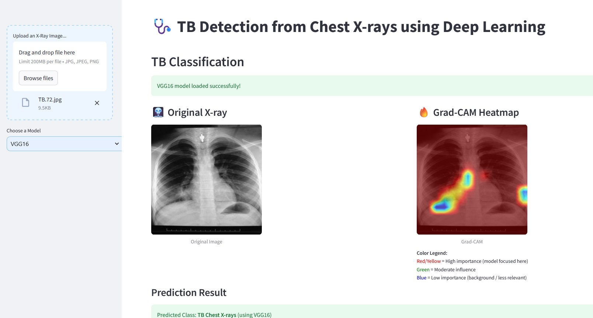

# 🩺 TB Detection from Chest X-rays using Deep Learning

This project aims to **detect Tuberculosis (TB)** using chest X-ray images through **deep learning models**. A Streamlit web application is built to allow users to upload X-ray images, choose a pre-trained model, and view predictions with **explainable AI** techniques like **Grad-CAM** and **LIME**.

---

## 🧠 Models Integrated

| Model Name     | Framework | Explainability | Notes                                 |
|----------------|-----------|----------------|----------------------------------------|
| DenseNet121    | Keras     | Grad-CAM       | Default and lightweight model          |
| VGG16          | PyTorch   | Grad-CAM       | Classical deep network for image tasks |
| ResNet50       | PyTorch   | LIME           | Robust residual connections            |
| EfficientNetB1 | Keras     | Grad-CAM       | Scalable and high-accuracy model       |

---

## 🚀 Features

- 📤 Upload chest X-ray images (`.jpg`, `.jpeg`, `.png`)
- 🧠 Choose model from dropdown
- ✅ Get predicted class (TB/Normal) with confidence
- 🔥 View **Grad-CAM** heatmaps (for DenseNet121, VGG16, EfficientNetB1)
- 🧾 View **LIME** explanations (for ResNet50)
- 📊 Confidence score bar
- 🎨 Intuitive and clean UI with a medical-themed background

---

## 📂 File Structure

```
📦 tb-xray-app/
├── app.py                  # Streamlit app
├── tb_model.keras          # DenseNet121 Keras model
├── best_resnet50_tuberculosis.pth  # ResNet50 model
├── best_vgg16_tuberculosis.pth     # VGG16 model
├── efficientnet_model.keras        # EfficientNetB1 model
├── requirements.txt
├── README.md
└── TB_Image_Background.png # Background image
```

---

## 📷 Sample UI



---

## 🔍 Explainable AI Techniques

### ✅ Grad-CAM (for CNN-based models)
Highlights the important regions in the X-ray image that influenced the model’s decision.

### ✅ LIME (for ResNet50)
LIME segments the image and perturbs regions to estimate the effect on model output.

---

## 🛠️ Setup & Run Locally

1. **Clone Repository**
```bash
git clone https://github.com/chiru2122mca/tb-xray-app.git
cd tb-xray-app
```

2. **Install Dependencies**
```bash
pip install -r requirements.txt
```

3. **Run the App**
```bash
streamlit run app.py
```

---

## ☁️ Deploy to Streamlit Cloud

Ensure the following files are included:
- `app.py`
- All model files (`.pth` or `.keras`)
- `requirements.txt`
- `README.md`

Upload to GitHub and connect to [Streamlit Cloud](https://streamlit.io/cloud) for instant deployment.

---

## 🧪 Datasets Used

- Open-source chest X-ray datasets for TB detection
- Preprocessed to 224x224 resolution, normalized, and split into train/test

---

## 🙌 Acknowledgements

- [Keras Applications](https://keras.io/api/applications/)
- [TorchVision Models](https://pytorch.org/vision/stable/models.html)
- [Streamlit](https://streamlit.io/)
- [Grad-CAM Paper](https://arxiv.org/abs/1610.02391)
- [LIME for PyTorch](https://github.com/marcotcr/lime)

---

## 👨‍🔬 Authors

Capstone Project - **BITS Pilani WILP Group 17**  
`2025 © TB Detection Project`
